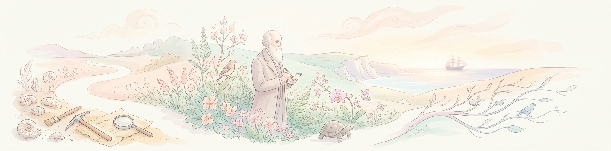
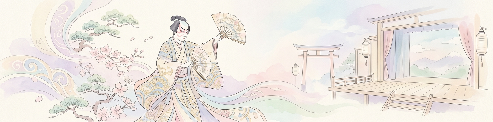
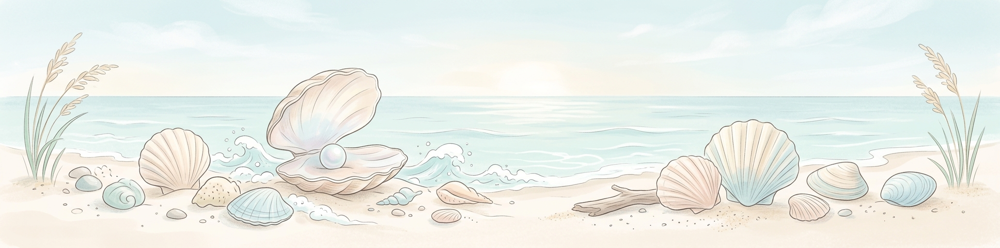

# 2月のヘッダー画像

| 日付 | 画像プレビュー | 説明 |
| :--- | :--- | :--- |
| 02-01 |  | テレビ放送記念日：日本で初めてテレビ放送が開始された日。 |
| 02-02 |  | 節分：豆まきをして邪気を払い、福を呼び込む伝統行事。 |
| 02-03 |  | 立春：暦の上で春が始まる日。新しい季節の訪れ。 |
| 02-04 |  | 世界対がんデー：がんへの意識を高め、予防と治療を考える日。 |
| 02-05 |  | ニコニコの日：笑顔で過ごし、周囲に幸せを広げる日。 |
| 02-06 |  | ブログの日：日々の想いや情報を綴るブログ文化を祝う。 |
| 02-07 |  | 北方領土の日：平和と領土について考える日。 |
| 02-08 |  | 針供養：折れた針を豆腐に刺して供養し、裁縫の上達を願う。 |
| 02-09 |  | 肉の日：美味しいお肉料理を楽しみ、活力を養う日。 |
| 02-10 |  | ニットの日：編み物の温もりと手作りの楽しさを感じる日。 |
| 02-11 |  | 建国記念の日：国の成り立ちをしのび、国を愛する心を養う。 |
| 02-12 |  | ダーウィンの日：進化論を提唱したダーウィンの功績と科学を祝う。 |
| 02-13 |  | 世界ラジオの日：情報を伝え、人々を繋ぐラジオの役割を称える。 |
| 02-14 |  | バレンタインデー：大切な人に愛や感謝を伝える日。 |
| 02-15 |  | 世界カバの日：カバの生態を知り、保護について考える日。 |
| 02-16 |  | 天気図記念日：日本で初めて天気図が作成された日。 |
| 02-17 |  | 天使のささやきの日：ダイヤモンドダストが見られる幻想的な日。 |
| 02-18 |  | エアメールの日：遠く離れた場所へ届く手紙と空の旅。 |
| 02-19 |  | 天地の日：コペルニクスの誕生日にちなみ、宇宙の理を考える。 |
| 02-20 |  | 歌舞伎の日：出雲の阿国が江戸で初めて歌舞伎を披露した日。 |
| 02-21 |  | 国際母語デー：言語の多様性と文化的な理解を深める日。 |
| 02-22 |  | 猫の日：猫との暮らしを慈しみ、感謝する日。 |
| 02-23 |  | 富士山の日：日本の象徴である富士山を愛で、保護する日。 |
| 02-24 |  | 鉄道ストの日：かつての労働運動を振り返り、現代の労働を考える。 |
| 02-25 |  | ひざの日：健康な体を維持し、活動的に過ごすことを意識する。 |
| 02-26 |  | 脱出の日：ナポレオンがエルバ島を脱出した日にちなみ、新しい道を探る。 |
| 02-27 |  | 絆の日：冬の寒さの中で、人との温かい繋がりを再確認する日。 |
| 02-28 |  | ビスケットの日：日本で初めてビスケットの製法が紹介された日。 |
| 02-29 |  | 閏日：4年に一度の特別な日。ボーナスの1日を大切に過ごす。 |
