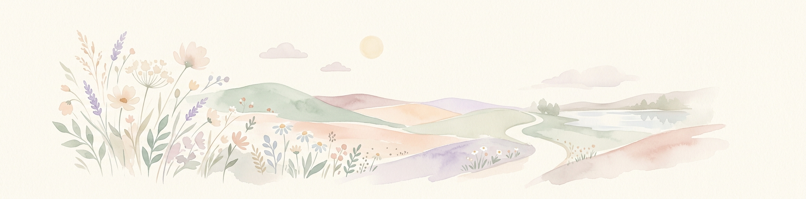
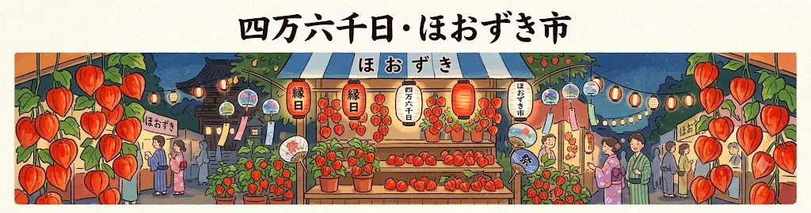
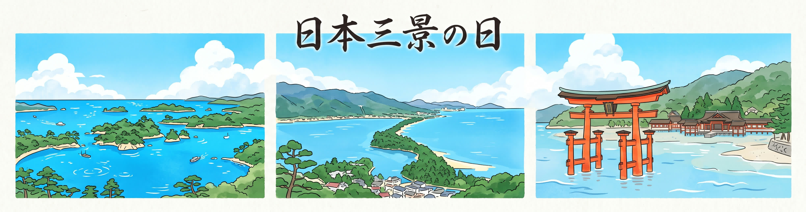
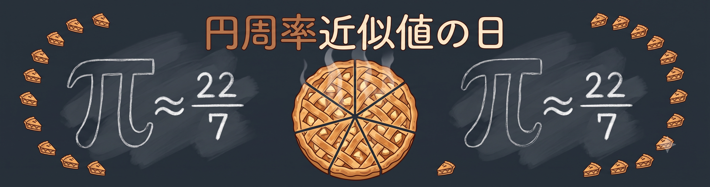
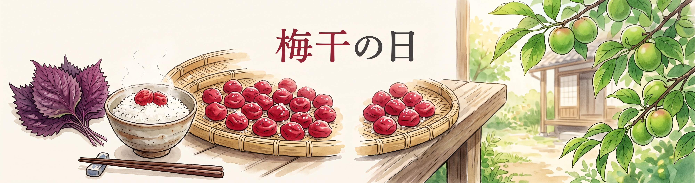

# 7月のヘッダー画像

| 日付 | 画像プレビュー | 説明 |
| :--- | :--- | :--- |
| 07-01 |  | カッシーニ土星到着日 |
| 07-02 |  | 7月2日のヘッダー画像。夏本番、海や空の輝き。 |
| 07-03 |  | 波の日 |
| 07-04 |  | 7月4日のヘッダー画像。夏本番、海や空の輝き。 |
| 07-05 |  | 7月5日のヘッダー画像。夏本番、海や空の輝き。 |
| 07-06 |  | 7月6日のヘッダー画像。夏本番、海や空の輝き。 |
| 07-07 |  | 川の日 |
| 07-08 |  | なはの日 |
| 07-09 |  | 7月9日のヘッダー画像。夏本番、海や空の輝き。 |
| 07-10 |  | 四万六千日・ほおずき市 |
| 07-11 |  | 7月11日のヘッダー画像。夏本番、海や空の輝き。 |
| 07-12 |  | 7月12日のヘッダー画像。夏本番、海や空の輝き。 |
| 07-13 |  | 日本標準時制定記念日 |
| 07-14 |  | マッターホルン初登頂記念日 |
| 07-15 |  | 7月15日のヘッダー画像。夏本番、海や空の輝き。 |
| 07-16 |  | 7月16日のヘッダー画像。夏本番、海や空の輝き。 |
| 07-17 |  | 7月17日のヘッダー画像。夏本番、海や空の輝き。 |
| 07-18 |  | 7月18日のヘッダー画像。夏本番、海や空の輝き。 |
| 07-19 |  | 7月19日のヘッダー画像。夏本番、海や空の輝き。 |
| 07-20 |  | 7月20日のヘッダー画像。夏本番、海や空の輝き。 |
| 07-21 |  | 日本三景の日 |
| 07-22 |  | 円周率近似値の日 |
| 07-23 |  | 文月ふみの日 |
| 07-24 |  | マチュピチュ遺跡発見の日 |
| 07-25 |  | 7月25日のヘッダー画像。夏本番、海や空の輝き。 |
| 07-26 |  | 7月26日のヘッダー画像。夏本番、海や空の輝き。 |
| 07-27 |  | 7月27日のヘッダー画像。夏本番、海や空の輝き。 |
| 07-28 |  | 菜っ葉の日 |
| 07-29 |  | 7月29日のヘッダー画像。夏本番、海や空の輝き。 |
| 07-30 |  | 梅干の日 |
| 07-31 |  | 蓄音機の日 |
