# Daily Headers Assets

本ディレクトリには、AIによって生成された日替わりヘッダー画像と、そのテーマに関する説明が格納されています。

## 1月

| 日付 | 画像プレビュー | 説明 |
| :--- | :--- | :--- |
| 01-01 | 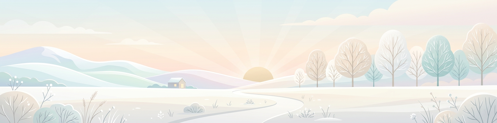 | 元日：一年の始まりを祝う日。初日の出と門松。 |
| 01-02 | 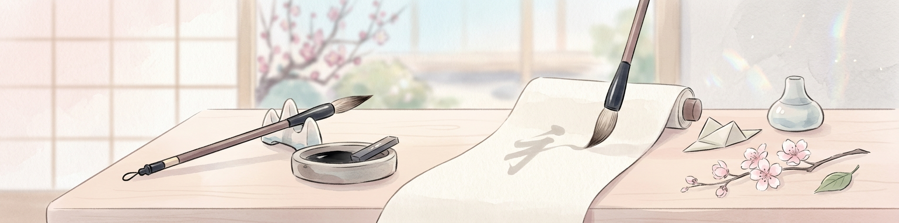 | 書き初め：年明けに初めて毛筆で文字や絵を書く行事。 |
| 01-03 | 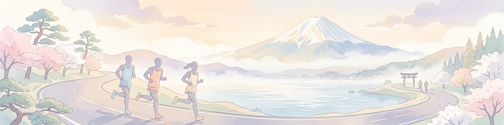 | 箱根駅伝：正月の風物詩である学生駅伝の熱気。 |
| 01-04 |  | 石の日：地蔵や石像に触れて健康を願う日。 |
| 01-05 | 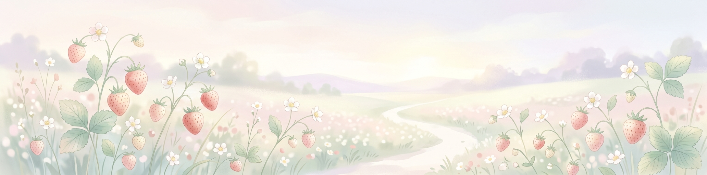 | いちごの日：旬のいちごを楽しみ、春の訪れを待つ日。 |
| 01-06 |  | 公現祭（エピファニー）：東方の三博士がキリストを訪問したことを祝う。 |
| 01-07 | 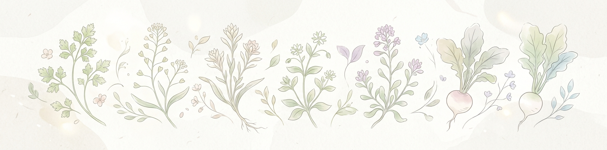 | 七草の日：春の七草粥を食べて無病息災を願う日。 |
| 01-08 |  | 外国語の日：新しい言葉や文化への好奇心を広げる日。 |
| 01-09 |  | クイズの日：知識と知恵を出し合い、楽しむ日。 |
| 01-10 |  | 110番の日：地域の安全と安心を考える日。 |
| 01-11 |  | 鏡開き：お正月に供えた鏡餅を割り、無病息災を願って食べる日。 |
| 01-12 |  | スキーの日：日本に初めて本格的なスキーが伝わった日。 |
| 01-13 |  | タバコの日：かつての文化を振り返り、現代の健康を考える。 |
| 01-14 |  | タロとジロの日：南極での絆と生命力を称える日。 |
| 01-15 |  | 成人の日：大人の仲間入りをした若者たちの門出を祝う。 |
| 01-16 | 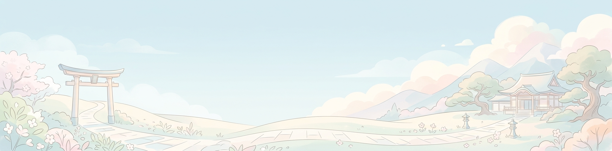 | 初閻魔（閻魔参り）：地獄の王、閻魔様に一年の平穏を願う。 |
| 01-17 |  | 防災とボランティアの日：震災を忘れず、助け合いの精神を確認する。 |
| 01-18 |  | 都バス記念日：都市の交通を支える風景を愛でる。 |
| 01-19 |  | のど自慢の日：歌を歌って、明るく健やかに過ごす日。 |
| 01-20 |  | 二十日正月：お正月の行事を締めくくり、日常に戻る日。 |
| 01-21 | 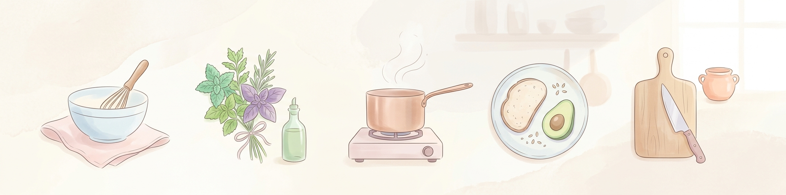 | 料理番組の日：美味しい料理と創造性を共有する日。 |
| 01-22 | 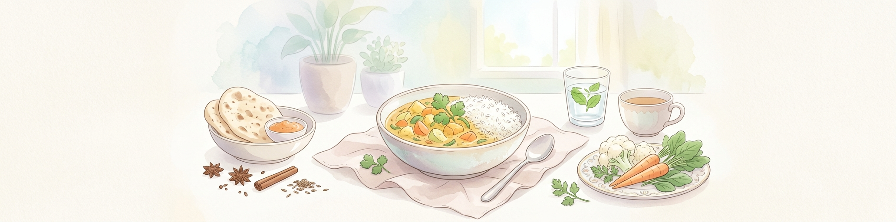 | カレーの日：国民食であるカレーライスを楽しむ日。 |
| 01-23 |  | 電子メールの日：デジタルのメッセージが繋ぐ絆を祝う。 |
| 01-24 |  | ゴールドラッシュの日：夢と冒険、新しい発見への挑戦。 |
| 01-25 |  | ホットケーキの日：暖かくて甘いホットケーキで幸せを感じる日。 |
| 01-26 |  | 文化財防火デー：貴重な文化遺産を火災から守る意識を高める日。 |
| 01-27 |  | 求婚の日：愛の告白や大切な人への想いを伝える日。 |
| 01-28 |  | コピーライターの日：言葉の力で価値を伝える創造性を称える日。 |
| 01-29 |  | 昭和基地開設記念日：南極観測の歴史と未知への探求。 |
| 01-30 | 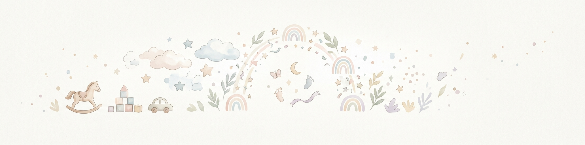 | 3分間電話の日：コミュニケーションの大切さを再確認する。 |
| 01-31 |  | 愛妻の日：大切なパートナーに感謝と愛情を伝える日。 |

## 2月

| 日付 | 画像プレビュー | 説明 |
| :--- | :--- | :--- |
| 02-01 |  | テレビ放送記念日：日本で初めてテレビ放送が開始された日。 |
| 02-02 |  | 節分：豆まきをして邪気を払い、福を呼び込む伝統行事。 |
| 02-03 |  | 立春：暦の上で春が始まる日。新しい季節の訪れ。 |
| 02-04 |  | 世界対がんデー：がんへの意識を高め、予防と治療を考える日。 |
| 02-05 |  | ニコニコの日：笑顔で過ごし、周囲に幸せを広げる日。 |
| 02-06 |  | ブログの日：日々の想いや情報を綴るブログ文化を祝う。 |
| 02-07 |  | 北方領土の日：平和と領土について考える日。 |
| 02-08 |  | 針供養：折れた針を豆腐に刺して供養し、裁縫の上達を願う。 |
| 02-09 |  | 肉の日：美味しいお肉料理を楽しみ、活力を養う日。 |
| 02-10 |  | ニットの日：編み物の温もりと手作りの楽しさを感じる日。 |
| 02-11 |  | 建国記念の日：国の成り立ちをしのび、国を愛する心を養う。 |
| 02-12 |  | ダーウィンの日：進化論を提唱したダーウィンの功績と科学を祝う。 |
| 02-13 |  | 世界ラジオの日：情報を伝え、人々を繋ぐラジオの役割を称える。 |
| 02-14 |  | バレンタインデー：大切な人に愛や感謝を伝える日。 |
| 02-15 |  | 世界カバの日：カバの生態を知り、保護について考える日。 |
| 02-16 |  | 天気図記念日：日本で初めて天気図が作成された日。 |
| 02-17 |  | 天使のささやきの日：ダイヤモンドダストが見られる幻想的な日。 |
| 02-18 |  | エアメールの日：遠く離れた場所へ届く手紙と空の旅。 |
| 02-19 |  | 天地の日：コペルニクスの誕生日にちなみ、宇宙の理を考える。 |
| 02-20 |  | 歌舞伎の日：出雲の阿国が江戸で初めて歌舞伎を披露した日。 |
| 02-21 |  | 国際母語デー：言語の多様性と文化的な理解を深める日。 |
| 02-22 |  | 猫の日：猫との暮らしを慈しみ、感謝する日。 |
| 02-23 |  | 富士山の日：日本の象徴である富士山を愛で、保護する日。 |
| 02-24 |  | 鉄道ストの日：かつての労働運動を振り返り、現代の労働を考える。 |
| 02-25 |  | ひざの日：健康な体を維持し、活動的に過ごすことを意識する。 |
| 02-26 |  | 脱出の日：ナポレオンがエルバ島を脱出した日にちなみ、新しい道を探る。 |
| 02-27 |  | 絆の日：冬の寒さの中で、人との温かい繋がりを再確認する日。 |
| 02-28 |  | ビスケットの日：日本で初めてビスケットの製法が紹介された日。 |
| 02-29 |  | 閏日：4年に一度の特別な日。ボーナスの1日を大切に過ごす。 |

## 3月

| 日付 | 画像プレビュー | 説明 |
| :--- | :--- | :--- |
| 03-01 | 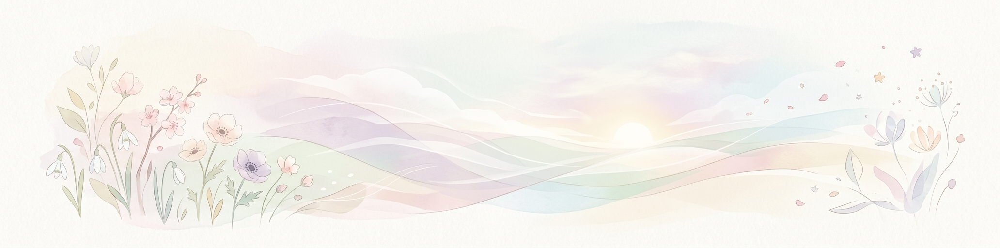 | 3月1日。春の始まりを感じる日。 |
| 03-02 | 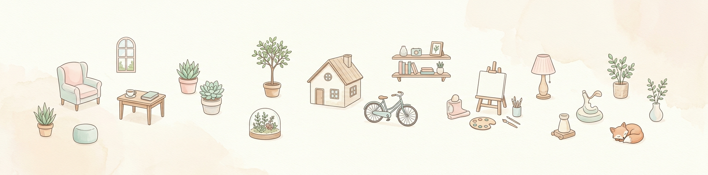 | ミニの日。ミニチュアや小さいものを愛でる日。 |
| 03-03 | 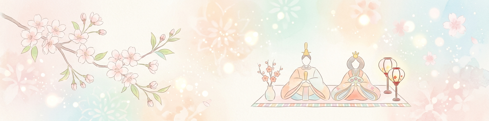 | ひな祭り。女の子の健やかな成長を願う行事。 |
| 03-04 |  | 雑誌の日。新しい情報や文化に触れる日。 |
| 03-05 |  | 珊瑚の日。海の宝石、サンゴ礁を保護する日。 |
| 03-06 |  | 弟の日。兄弟の絆を大切にする日。 |
| 03-07 |  | サウナの日。心身を整え、リラックスする日。 |
| 03-08 |  | 国際女性デー。ミモザの花と共に女性の功績を称える日。 |
| 03-09 | 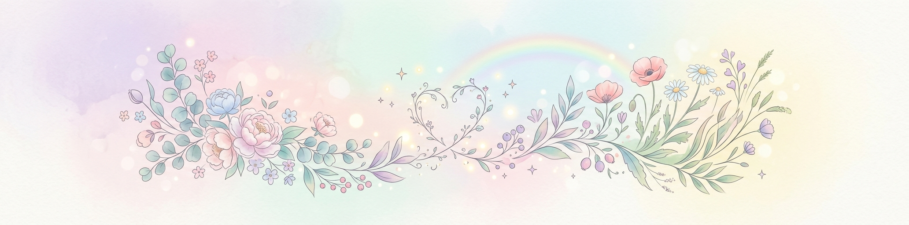 | ありがとうの日。感謝の気持ちを伝える日。 |
| 03-10 |  | 砂糖の日。甘いお菓子で幸せを感じる日。 |
| 03-11 |  | 震災復興と絆。希望と祈りを捧げる日。 |
| 03-12 |  | 財布の日。新しい財布で金運や良縁を願う日。 |
| 03-13 |  | サンドイッチの日。手軽で楽しい食事を楽しむ日。 |
| 03-14 |  | ホワイトデー。贈り物で想いを返す日。 |
| 03-15 | 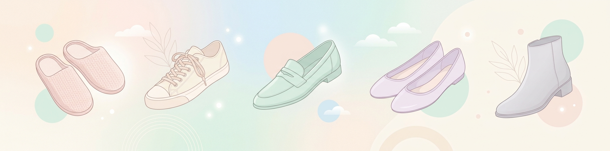 | 靴の日。新しい一歩を踏み出す日。 |
| 03-16 |  | 国立公園指定記念日。豊かな自然を保護し、愛でる日。 |
| 03-17 |  | 漫画週刊誌の日。日本の漫画文化を祝う日。 |
| 03-18 |  | 点字ブロックの日。誰もが安心して歩ける社会を願う日。 |
| 03-19 |  | ミュージックの日。音楽の力を感じる日。 |
| 03-20 |  | 春分の日。自然を称え、生物を慈しむ日。 |
| 03-21 |  | 世界詩歌デー。言葉の美しさと表現を祝う日。 |
| 03-22 |  | 世界水の日。大切な資源である水を考える日。 |
| 03-23 |  | 世界気象デー：1950年のこの日に世界気象機関（WMO）が発足したことを記念。 |
| 03-24 |  | マネキン記念日：1928年のこの日、上野の博覧会で日本初のマネキンガールが登場したことを記念。 |
| 03-25 |  | 電気記念日：1878年のこの日、東京で日本初の電灯が公に点灯されたことを記念。 |
| 03-26 |  | カチューシャの歌の日：1914年のこの日、劇中歌『カチューシャの歌』が初披露され大流行したことを記念。 |
| 03-27 |  | さくらの日：3×9＝27の語呂合わせと、七十二候の一つ「桜始開」が重なる時期であることから。 |
| 03-28 |  | シルクロードの日：1900年のこの日、スウェーデンの探検家ヘディンによって楼蘭が発見されたことを記念。 |
| 03-29 |  | マリモの日：1952年のこの日、阿寒湖のマリモが国の特別天然記念物に指定されたことを記念。 |
| 03-30 |  | 消しゴム付き鉛筆の日：1858年のこの日、アメリカで消しゴム付き鉛筆の特許が初めて取得されたことを記念。 |
| 03-31 |  | オーケストラの日：「み（3）み（3）に（2）い（1）い」の語呂合わせで、オーケストラをより身近に感じてもらうための日。 |

## 4月

| 日付 | 画像プレビュー | 説明 |
| :--- | :--- | :--- |
| 04-01 |  | エイプリルフール：嘘をついても良いとされる日。創造的で楽しい嘘やいたずらを楽しむ日。 |
| 04-02 |  | 国際子どもの本の日：アンデルセンの誕生日にちなみ、子どもの本への関心を高める日。 |
| 04-03 |  | シーサーの日：沖縄の守り神「シーサー」を記念する日。 |
| 04-04 |  | ピアノ調律の日：調律の基準音 A=440Hz にちなみ、ピアノの音を整える技術を称える日。 |
| 04-05 |  | ヘアカットの日：明治政府が断髪を許可した日。新しい自分に生まれ変わるイメージ。 |
| 04-06 |  | 城の日：「し(4)ろ(6)」の語呂合わせ。日本の伝統的な城郭建築を愛でる日。 |
| 04-07 |  | 世界保健デー：世界保健機関 (WHO) の発足を記念し、健康への意識を高める日。 |
| 04-08 | 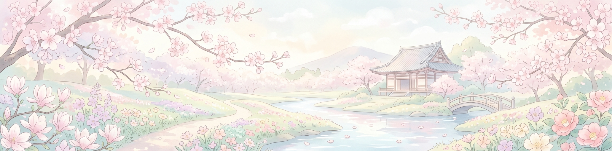 | 花まつり：お釈迦様の降誕を祝う行事。色とりどりの花で飾られた花御堂が象徴。 |
| 04-09 |  | 大仏の日：奈良・東大寺の大仏開眼供養が行われた日。平和と安寧を願う。 |
| 04-10 |  | ヨットの日：「ヨ(4)ット(10)」の語呂合わせ。海と風を感じるスポーツを記念する日。 |
| 04-11 |  | ガッツポーズの日：勝利の喜びを表現する「ガッツポーズ」という言葉が広まった日。 |
| 04-12 |  | 世界宇宙飛行の日：ガガーリンが人類初の宇宙飛行に成功した日。宇宙へのロマン。 |
| 04-13 |  | 喫茶店の日：日本初の本格的な喫茶店が開業した日。ゆったりとした時間を楽しむ。 |
| 04-14 |  | オレンジデー：大切な人との絆を深めるため、オレンジ色のものを贈り合う日。 |
| 04-15 |  | ヘリコプターの日：ダ・ヴィンチの誕生日にちなみ、空飛ぶ機械への夢を馳せる日。 |
| 04-16 |  | チャップリンデー：喜劇王チャップリンの誕生日にちなみ、笑いと平和を考える日。 |
| 04-17 |  | 恐竜の日：初めて恐竜の卵の化石が発見された日。太古の地球への想像力。 |
| 04-18 |  | 発明の日：現在の特許制度の元となる条例が公布された日。新しいアイデアを祝う日。 |
| 04-19 | 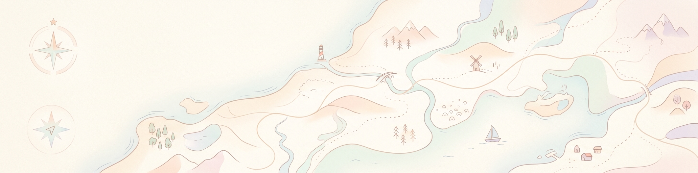 | 地図の日：伊能忠敬が日本地図作成のために初めて測量に出発した日。 |
| 04-20 |  | 郵政記念日：近代郵便制度が始まった日。手紙が運ぶ心と繋がりを記念する日。 |
| 04-21 |  | ゲームボーイの日：任天堂が携帯ゲーム機「ゲームボーイ」を発売した日。遊びの革新。 |
| 04-22 | 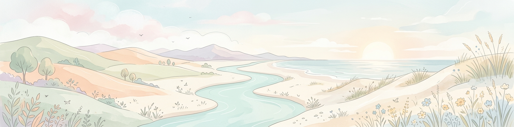 | アースデイ（地球の日）：地球環境について考え、感謝し、行動する日。 |
| 04-23 |  | 子ども読書の日：子どもたちが本に親しみ、読書の楽しさを知るための日。 |
| 04-24 | 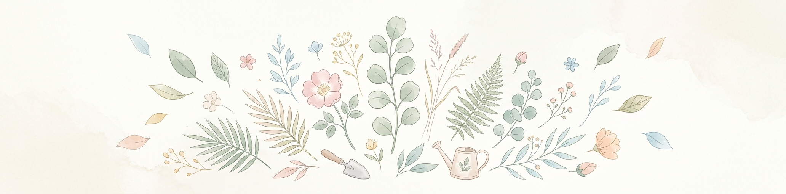 | 植物学の日：植物学者・牧野富太郎の誕生日にちなみ、身近な草花を愛でる日。 |
| 04-25 |  | 世界ペンギンの日：アデリーペンギンが北へ移動する時期にちなみ、ペンギンを保護する日。 |
| 04-26 |  | 世界知的財産の日：創造性とイノベーションを支える知的財産の役割を考える日。 |
| 04-27 |  | 哲学の日：古代ギリシャの哲学者ソクラテスの命日にちなみ、真理を追求する心を持つ日。 |
| 04-28 |  | 象の日：日本に初めて象がやってきた日。力強く優しい動物への親しみ。 |
| 04-29 | 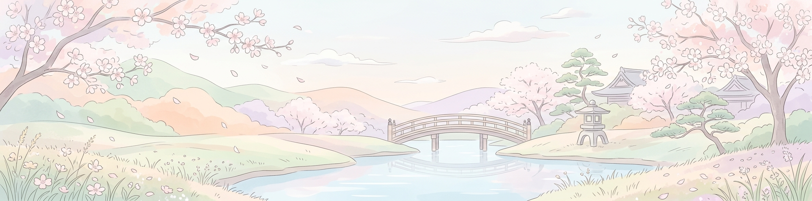 | 昭和の日：激動の日々を経て、復興を遂げた昭和の時代を顧み、国の将来に思いを馳せる日。 |
| 04-30 |  | 図書館記念日：図書館法が公布された日。知識の宝庫である図書館に親しむ日。 |

## 5月

| 日付 | 画像プレビュー | 説明 |
| :--- | :--- | :--- |
| 05-01 |  | 5月1日のヘッダー画像。初夏の爽やかな風景。 |
| 05-02 |  | 5月2日のヘッダー画像。初夏の爽やかな風景。 |
| 05-03 |  | 5月3日のヘッダー画像。初夏の爽やかな風景。 |
| 05-04 |  | 5月4日のヘッダー画像。初夏の爽やかな風景。 |
| 05-05 |  | 5月5日のヘッダー画像。初夏の爽やかな風景。 |
| 05-06 |  | 5月6日のヘッダー画像。初夏の爽やかな風景。 |
| 05-07 |  | 5月7日のヘッダー画像。初夏の爽やかな風景。 |
| 05-08 |  | 5月8日のヘッダー画像。初夏の爽やかな風景。 |
| 05-09 |  | 5月9日のヘッダー画像。初夏の爽やかな風景。 |
| 05-10 |  | 5月10日のヘッダー画像。初夏の爽やかな風景。 |
| 05-11 |  | 5月11日のヘッダー画像。初夏の爽やかな風景。 |
| 05-12 |  | 5月12日のヘッダー画像。初夏の爽やかな風景。 |
| 05-13 |  | 5月13日のヘッダー画像。初夏の爽やかな風景。 |
| 05-14 |  | 5月14日のヘッダー画像。初夏の爽やかな風景。 |
| 05-15 |  | 5月15日のヘッダー画像。初夏の爽やかな風景。 |
| 05-16 |  | 5月16日のヘッダー画像。初夏の爽やかな風景。 |
| 05-17 |  | 5月17日のヘッダー画像。初夏の爽やかな風景。 |
| 05-18 |  | 5月18日のヘッダー画像。初夏の爽やかな風景。 |
| 05-19 |  | 5月19日のヘッダー画像。初夏の爽やかな風景。 |
| 05-20 |  | 5月20日のヘッダー画像。初夏の爽やかな風景。 |
| 05-21 |  | 5月21日のヘッダー画像。初夏の爽やかな風景。 |
| 05-22 |  | 5月22日のヘッダー画像。初夏の爽やかな風景。 |
| 05-23 |  | 5月23日のヘッダー画像。初夏の爽やかな風景。 |
| 05-24 |  | 5月24日のヘッダー画像。初夏の爽やかな風景。 |
| 05-25 |  | 5月25日のヘッダー画像。初夏の爽やかな風景。 |
| 05-26 |  | 5月26日のヘッダー画像。初夏の爽やかな風景。 |
| 05-27 |  | 5月27日のヘッダー画像。初夏の爽やかな風景。 |
| 05-28 |  | 5月28日のヘッダー画像。初夏の爽やかな風景。 |
| 05-29 |  | 5月29日のヘッダー画像。初夏の爽やかな風景。 |
| 05-30 |  | 5月30日のヘッダー画像。初夏の爽やかな風景。 |
| 05-31 |  | 5月31日のヘッダー画像。初夏の爽やかな風景。 |

## 6月

| 日付 | 画像プレビュー | 説明 |
| :--- | :--- | :--- |
| 06-01 |  | 6月1日のヘッダー画像。梅雨の情景や紫陽花。 |
| 06-02 |  | 6月2日のヘッダー画像。梅雨の情景や紫陽花。 |
| 06-03 | 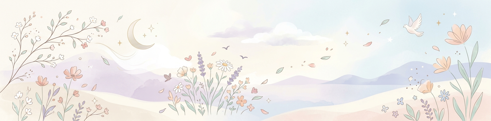 | 6月3日のヘッダー画像。梅雨の情景や紫陽花。 |
| 06-04 |  | 6月4日のヘッダー画像。梅雨の情景や紫陽花。 |
| 06-05 | 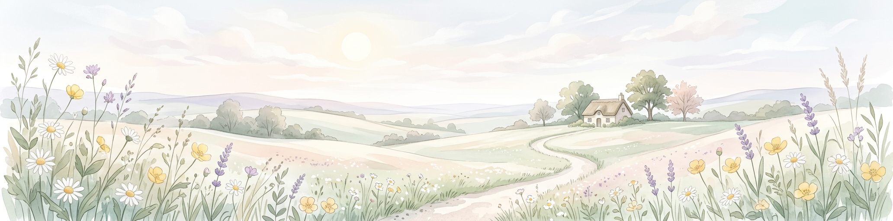 | 6月5日のヘッダー画像。梅雨の情景や紫陽花。 |
| 06-06 |  | 6月6日のヘッダー画像。梅雨の情景や紫陽花。 |
| 06-07 | 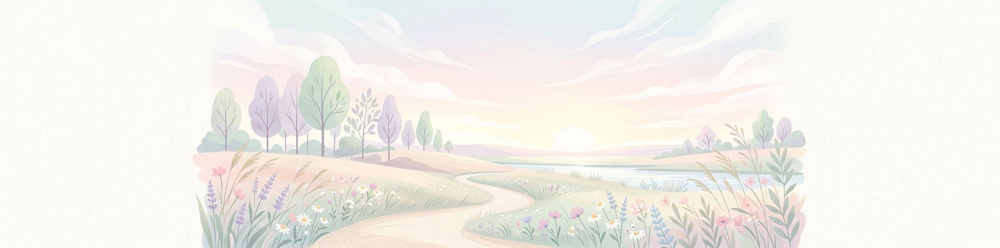 | 6月7日のヘッダー画像。梅雨の情景や紫陽花。 |
| 06-08 | 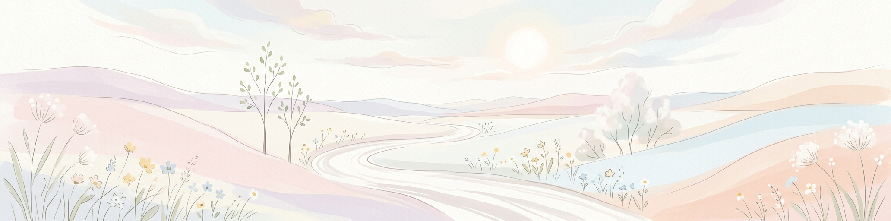 | 6月8日のヘッダー画像。梅雨の情景や紫陽花。 |
| 06-09 |  | 6月9日のヘッダー画像。梅雨の情景や紫陽花。 |
| 06-10 | 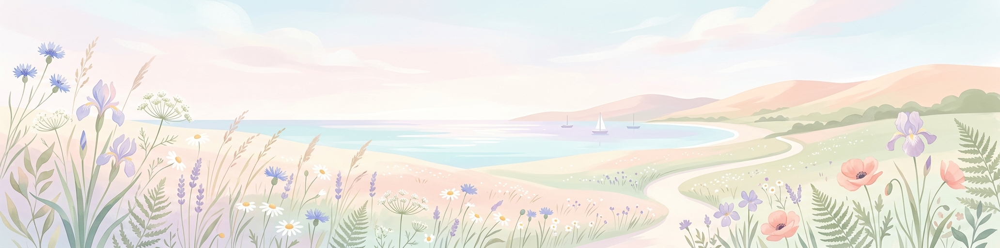 | 6月10日のヘッダー画像。梅雨の情景や紫陽花。 |
| 06-11 |  | 6月11日のヘッダー画像。梅雨の情景や紫陽花。 |
| 06-12 | 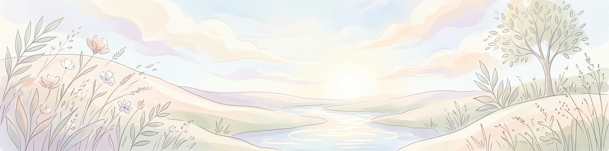 | 6月12日のヘッダー画像。梅雨の情景や紫陽花。 |
| 06-13 | 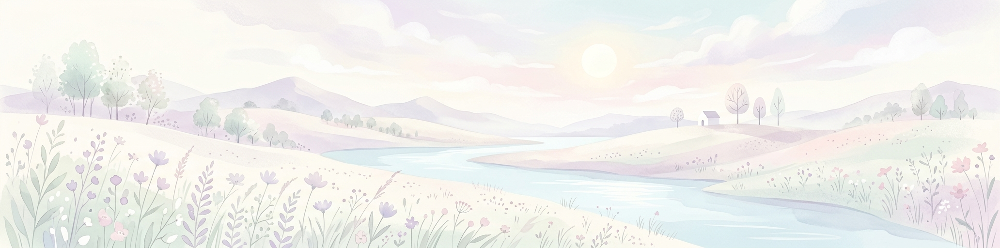 | 6月13日のヘッダー画像。梅雨の情景や紫陽花。 |
| 06-14 |  | 6月14日のヘッダー画像。梅雨の情景や紫陽花。 |
| 06-15 |  | 6月15日のヘッダー画像。梅雨の情景や紫陽花。 |
| 06-16 |  | 6月16日のヘッダー画像。梅雨の情景や紫陽花。 |
| 06-17 |  | 6月17日のヘッダー画像。梅雨の情景や紫陽花。 |
| 06-18 | 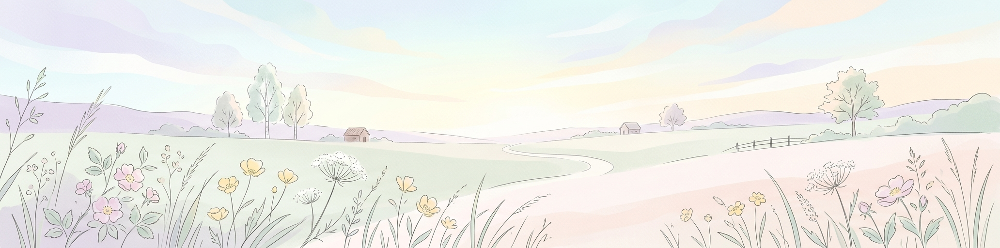 | 6月18日のヘッダー画像。梅雨の情景や紫陽花。 |
| 06-19 | 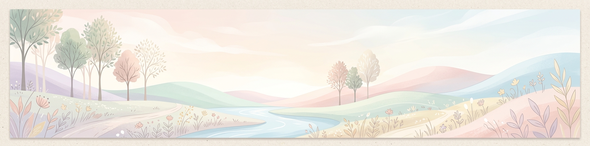 | 6月19日のヘッダー画像。梅雨の情景や紫陽花。 |
| 06-20 |  | 6月20日のヘッダー画像。梅雨の情景や紫陽花。 |
| 06-21 |  | 6月21日のヘッダー画像。梅雨の情景や紫陽花。 |
| 06-22 | 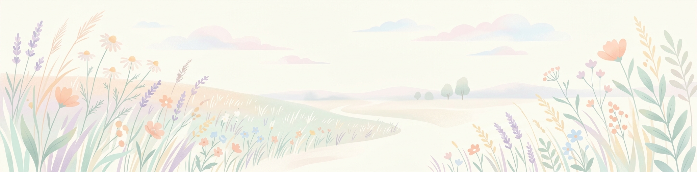 | 6月22日のヘッダー画像。梅雨の情景や紫陽花。 |
| 06-23 |  | 6月23日のヘッダー画像。梅雨の情景や紫陽花。 |
| 06-24 |  | 6月24日のヘッダー画像。梅雨の情景や紫陽花。 |
| 06-25 |  | 6月25日のヘッダー画像。梅雨の情景や紫陽花。 |
| 06-26 | 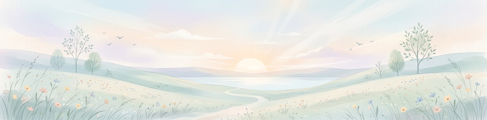 | 6月26日のヘッダー画像。梅雨の情景や紫陽花。 |
| 06-27 |  | 6月27日のヘッダー画像。梅雨の情景や紫陽花。 |
| 06-28 | 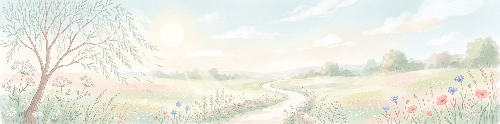 | 6月28日のヘッダー画像。梅雨の情景や紫陽花。 |
| 06-29 |  | 6月29日のヘッダー画像。梅雨の情景や紫陽花。 |
| 06-30 |  | 6月30日のヘッダー画像。梅雨の情景や紫陽花。 |

## 7月

| 日付 | 画像プレビュー | 説明 |
| :--- | :--- | :--- |
| 07-01 |  | 7月1日のヘッダー画像。夏本番、海や空の輝き。 |
| 07-02 |  | 7月2日のヘッダー画像。夏本番、海や空の輝き。 |
| 07-03 |  | 7月3日のヘッダー画像。夏本番、海や空の輝き。 |
| 07-04 |  | 7月4日のヘッダー画像。夏本番、海や空の輝き。 |
| 07-05 |  | 7月5日のヘッダー画像。夏本番、海や空の輝き。 |
| 07-06 |  | 7月6日のヘッダー画像。夏本番、海や空の輝き。 |
| 07-07 |  | 7月7日のヘッダー画像。夏本番、海や空の輝き。 |
| 07-08 |  | 7月8日のヘッダー画像。夏本番、海や空の輝き。 |
| 07-09 |  | 7月9日のヘッダー画像。夏本番、海や空の輝き。 |
| 07-10 |  | 7月10日のヘッダー画像。夏本番、海や空の輝き。 |
| 07-11 |  | 7月11日のヘッダー画像。夏本番、海や空の輝き。 |
| 07-12 |  | 7月12日のヘッダー画像。夏本番、海や空の輝き。 |
| 07-13 |  | 7月13日のヘッダー画像。夏本番、海や空の輝き。 |
| 07-14 |  | 7月14日のヘッダー画像。夏本番、海や空の輝き。 |
| 07-15 |  | 7月15日のヘッダー画像。夏本番、海や空の輝き。 |
| 07-16 |  | 7月16日のヘッダー画像。夏本番、海や空の輝き。 |
| 07-17 |  | 7月17日のヘッダー画像。夏本番、海や空の輝き。 |
| 07-18 |  | 7月18日のヘッダー画像。夏本番、海や空の輝き。 |
| 07-19 |  | 7月19日のヘッダー画像。夏本番、海や空の輝き。 |
| 07-20 |  | 7月20日のヘッダー画像。夏本番、海や空の輝き。 |
| 07-21 |  | 7月21日のヘッダー画像。夏本番、海や空の輝き。 |
| 07-22 |  | 7月22日のヘッダー画像。夏本番、海や空の輝き。 |
| 07-23 |  | 7月23日のヘッダー画像。夏本番、海や空の輝き。 |
| 07-24 |  | 7月24日のヘッダー画像。夏本番、海や空の輝き。 |
| 07-25 |  | 7月25日のヘッダー画像。夏本番、海や空の輝き。 |
| 07-26 |  | 7月26日のヘッダー画像。夏本番、海や空の輝き。 |
| 07-27 |  | 7月27日のヘッダー画像。夏本番、海や空の輝き。 |
| 07-28 |  | 7月28日のヘッダー画像。夏本番、海や空の輝き。 |
| 07-29 |  | 7月29日のヘッダー画像。夏本番、海や空の輝き。 |
| 07-30 |  | 7月30日のヘッダー画像。夏本番、海や空の輝き。 |
| 07-31 |  | 7月31日のヘッダー画像。夏本番、海や空の輝き。 |

## 8月

| 日付 | 画像プレビュー | 説明 |
| :--- | :--- | :--- |
| 08-01 |  | 8月1日のヘッダー画像。季節の移り変わりと風景。 |
| 08-02 |  | 8月2日のヘッダー画像。季節の移り変わりと風景。 |
| 08-03 |  | 8月3日のヘッダー画像。季節の移り変わりと風景。 |
| 08-04 |  | 8月4日のヘッダー画像。季節の移り変わりと風景。 |
| 08-05 |  | 8月5日のヘッダー画像。季節の移り変わりと風景。 |
| 08-06 |  | 8月6日のヘッダー画像。季節の移り変わりと風景。 |
| 08-07 |  | 8月7日のヘッダー画像。季節の移り変わりと風景。 |
| 08-08 |  | 8月8日のヘッダー画像。季節の移り変わりと風景。 |
| 08-09 |  | 8月9日のヘッダー画像。季節の移り変わりと風景。 |
| 08-10 |  | 8月10日のヘッダー画像。季節の移り変わりと風景。 |
| 08-11 |  | 8月11日のヘッダー画像。季節の移り変わりと風景。 |
| 08-12 |  | 8月12日のヘッダー画像。季節の移り変わりと風景。 |
| 08-13 |  | 8月13日のヘッダー画像。季節の移り変わりと風景。 |
| 08-14 |  | 8月14日のヘッダー画像。季節の移り変わりと風景。 |
| 08-15 |  | 8月15日のヘッダー画像。季節の移り変わりと風景。 |
| 08-16 |  | 8月16日のヘッダー画像。季節の移り変わりと風景。 |
| 08-17 |  | 8月17日のヘッダー画像。季節の移り変わりと風景。 |
| 08-18 |  | 8月18日のヘッダー画像。季節の移り変わりと風景。 |
| 08-19 |  | 8月19日のヘッダー画像。季節の移り変わりと風景。 |
| 08-20 |  | 8月20日のヘッダー画像。季節の移り変わりと風景。 |
| 08-21 |  | 8月21日のヘッダー画像。季節の移り変わりと風景。 |
| 08-22 |  | 8月22日のヘッダー画像。季節の移り変わりと風景。 |
| 08-23 |  | 8月23日のヘッダー画像。季節の移り変わりと風景。 |
| 08-24 |  | 8月24日のヘッダー画像。季節の移り変わりと風景。 |
| 08-25 |  | 8月25日のヘッダー画像。季節の移り変わりと風景。 |
| 08-26 |  | 8月26日のヘッダー画像。季節の移り変わりと風景。 |
| 08-27 |  | 8月27日のヘッダー画像。季節の移り変わりと風景。 |
| 08-28 |  | 8月28日のヘッダー画像。季節の移り変わりと風景。 |
| 08-29 |  | 8月29日のヘッダー画像。季節の移り変わりと風景。 |
| 08-30 |  | 8月30日のヘッダー画像。季節の移り変わりと風景。 |
| 08-31 |  | 8月31日のヘッダー画像。季節の移り変わりと風景。 |

## 9月

| 日付 | 画像プレビュー | 説明 |
| :--- | :--- | :--- |
| 09-01 |  | 9月1日のヘッダー画像。季節の移り変わりと風景。 |
| 09-02 |  | 9月2日のヘッダー画像。季節の移り変わりと風景。 |
| 09-03 |  | 9月3日のヘッダー画像。季節の移り変わりと風景。 |
| 09-04 |  | 9月4日のヘッダー画像。季節の移り変わりと風景。 |
| 09-05 |  | 9月5日のヘッダー画像。季節の移り変わりと風景。 |
| 09-06 |  | 9月6日のヘッダー画像。季節の移り変わりと風景。 |
| 09-07 |  | 9月7日のヘッダー画像。季節の移り変わりと風景。 |
| 09-08 |  | 9月8日のヘッダー画像。季節の移り変わりと風景。 |
| 09-09 | 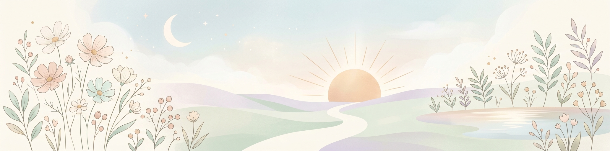 | 9月9日のヘッダー画像。季節の移り変わりと風景。 |
| 09-10 |  | 9月10日のヘッダー画像。季節の移り変わりと風景。 |
| 09-11 |  | 9月11日のヘッダー画像。季節の移り変わりと風景。 |
| 09-12 |  | 9月12日のヘッダー画像。季節の移り変わりと風景。 |
| 09-13 |  | 9月13日のヘッダー画像。季節の移り変わりと風景。 |
| 09-14 |  | 9月14日のヘッダー画像。季節の移り変わりと風景。 |
| 09-15 |  | 9月15日のヘッダー画像。季節の移り変わりと風景。 |
| 09-16 |  | 9月16日のヘッダー画像。季節の移り変わりと風景。 |
| 09-17 |  | 9月17日のヘッダー画像。季節の移り変わりと風景。 |
| 09-18 |  | 9月18日のヘッダー画像。季節の移り変わりと風景。 |
| 09-19 | 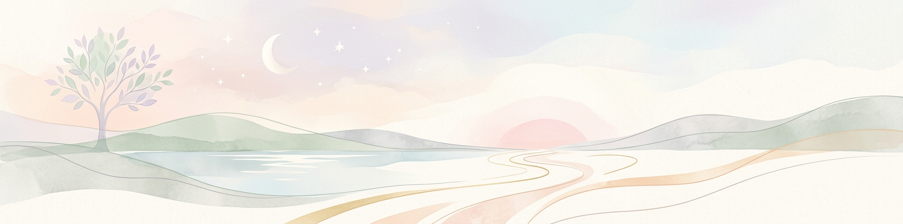 | 9月19日のヘッダー画像。季節の移り変わりと風景。 |
| 09-20 |  | 9月20日のヘッダー画像。季節の移り変わりと風景。 |
| 09-21 |  | 9月21日のヘッダー画像。季節の移り変わりと風景。 |
| 09-22 |  | 9月22日のヘッダー画像。季節の移り変わりと風景。 |
| 09-23 |  | 9月23日のヘッダー画像。季節の移り変わりと風景。 |
| 09-24 |  | 9月24日のヘッダー画像。季節の移り変わりと風景。 |
| 09-25 |  | 9月25日のヘッダー画像。季節の移り変わりと風景。 |
| 09-26 |  | 9月26日のヘッダー画像。季節の移り変わりと風景。 |
| 09-27 |  | 9月27日のヘッダー画像。季節の移り変わりと風景。 |
| 09-28 |  | 9月28日のヘッダー画像。季節の移り変わりと風景。 |
| 09-29 | 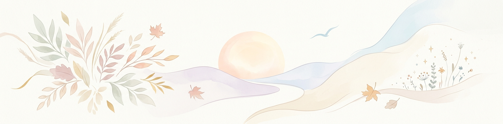 | 9月29日のヘッダー画像。季節の移り変わりと風景。 |
| 09-30 |  | 9月30日のヘッダー画像。季節の移り変わりと風景。 |

## 10月

| 日付 | 画像プレビュー | 説明 |
| :--- | :--- | :--- |
| 10-01 | 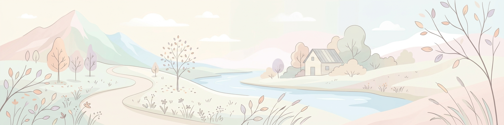 | 10月1日のヘッダー画像。季節の移り変わりと風景。 |
| 10-02 |  | 10月2日のヘッダー画像。季節の移り変わりと風景。 |
| 10-03 |  | 10月3日のヘッダー画像。季節の移り変わりと風景。 |
| 10-04 |  | 10月4日のヘッダー画像。季節の移り変わりと風景。 |
| 10-05 |  | 10月5日のヘッダー画像。季節の移り変わりと風景。 |
| 10-06 |  | 10月6日のヘッダー画像。季節の移り変わりと風景。 |
| 10-07 |  | 10月7日のヘッダー画像。季節の移り変わりと風景。 |
| 10-08 |  | 10月8日のヘッダー画像。季節の移り変わりと風景。 |
| 10-09 |  | 10月9日のヘッダー画像。季節の移り変わりと風景。 |
| 10-10 |  | 10月10日のヘッダー画像。季節の移り変わりと風景。 |
| 10-11 |  | 10月11日のヘッダー画像。季節の移り変わりと風景。 |
| 10-12 | 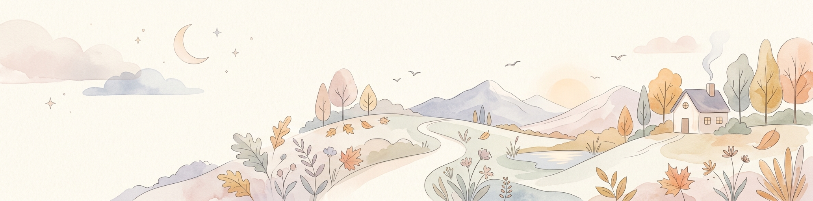 | 10月12日のヘッダー画像。季節の移り変わりと風景。 |
| 10-13 |  | 10月13日のヘッダー画像。季節の移り変わりと風景。 |
| 10-14 |  | 10月14日のヘッダー画像。季節の移り変わりと風景。 |
| 10-15 |  | 10月15日のヘッダー画像。季節の移り変わりと風景。 |
| 10-16 |  | 10月16日のヘッダー画像。季節の移り変わりと風景。 |
| 10-17 |  | 10月17日のヘッダー画像。季節の移り変わりと風景。 |
| 10-18 |  | 10月18日のヘッダー画像。季節の移り変わりと風景。 |
| 10-19 |  | 10月19日のヘッダー画像。季節の移り変わりと風景。 |
| 10-20 |  | 10月20日のヘッダー画像。季節の移り変わりと風景。 |
| 10-21 |  | 10月21日のヘッダー画像。季節の移り変わりと風景。 |
| 10-22 |  | 10月22日のヘッダー画像。季節の移り変わりと風景。 |
| 10-23 | 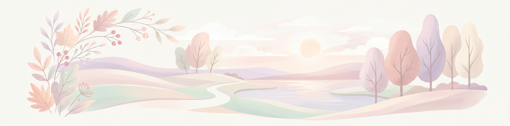 | 10月23日のヘッダー画像。季節の移り変わりと風景。 |
| 10-24 |  | 10月24日のヘッダー画像。季節の移り変わりと風景。 |
| 10-25 | 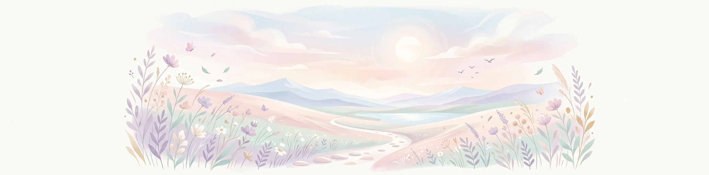 | 10月25日のヘッダー画像。季節の移り変わりと風景。 |
| 10-26 |  | 10月26日のヘッダー画像。季節の移り変わりと風景。 |
| 10-27 |  | 10月27日のヘッダー画像。季節の移り変わりと風景。 |
| 10-28 |  | 10月28日のヘッダー画像。季節の移り変わりと風景。 |
| 10-29 |  | 10月29日のヘッダー画像。季節の移り変わりと風景。 |
| 10-30 | 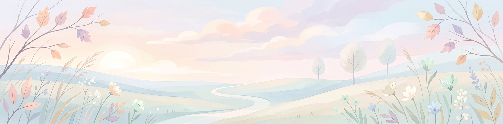 | 10月30日のヘッダー画像。季節の移り変わりと風景。 |
| 10-31 |  | 10月31日のヘッダー画像。季節の移り変わりと風景。 |

## 11月

| 日付 | 画像プレビュー | 説明 |
| :--- | :--- | :--- |
| 11-01 |  | 11月1日のヘッダー画像。季節の移り変わりと風景。 |
| 11-02 |  | 11月2日のヘッダー画像。季節の移り変わりと風景。 |
| 11-03 |  | 11月3日のヘッダー画像。季節の移り変わりと風景。 |
| 11-04 |  | 11月4日のヘッダー画像。季節の移り変わりと風景。 |
| 11-05 |  | 11月5日のヘッダー画像。季節の移り変わりと風景。 |
| 11-06 |  | 11月6日のヘッダー画像。季節の移り変わりと風景。 |
| 11-07 |  | 11月7日のヘッダー画像。季節の移り変わりと風景。 |
| 11-08 |  | 11月8日のヘッダー画像。季節の移り変わりと風景。 |
| 11-09 |  | 11月9日のヘッダー画像。季節の移り変わりと風景。 |
| 11-10 |  | 11月10日のヘッダー画像。季節の移り変わりと風景。 |
| 11-11 |  | 11月11日のヘッダー画像。季節の移り変わりと風景。 |
| 11-12 |  | 11月12日のヘッダー画像。季節の移り変わりと風景。 |
| 11-13 |  | 11月13日のヘッダー画像。季節の移り変わりと風景。 |
| 11-14 | 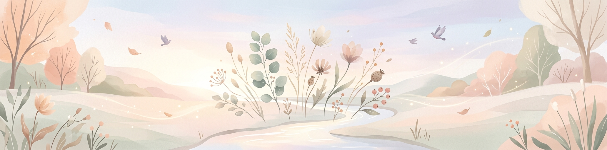 | 11月14日のヘッダー画像。季節の移り変わりと風景。 |
| 11-15 |  | 11月15日のヘッダー画像。季節の移り変わりと風景。 |
| 11-16 |  | 11月16日のヘッダー画像。季節の移り変わりと風景。 |
| 11-17 |  | 11月17日のヘッダー画像。季節の移り変わりと風景。 |
| 11-18 |  | 11月18日のヘッダー画像。季節の移り変わりと風景。 |
| 11-19 |  | 11月19日のヘッダー画像。季節の移り変わりと風景。 |
| 11-20 |  | 11月20日のヘッダー画像。季節の移り変わりと風景。 |
| 11-21 |  | 11月21日のヘッダー画像。季節の移り変わりと風景。 |
| 11-22 |  | 11月22日のヘッダー画像。季節の移り変わりと風景。 |
| 11-23 |  | 11月23日のヘッダー画像。季節の移り変わりと風景。 |
| 11-24 |  | 11月24日のヘッダー画像。季節の移り変わりと風景。 |
| 11-25 |  | 11月25日のヘッダー画像。季節の移り変わりと風景。 |
| 11-26 |  | 11月26日のヘッダー画像。季節の移り変わりと風景。 |
| 11-27 |  | 11月27日のヘッダー画像。季節の移り変わりと風景。 |
| 11-28 |  | 11月28日のヘッダー画像。季節の移り変わりと風景。 |
| 11-29 |  | 11月29日のヘッダー画像。季節の移り変わりと風景。 |
| 11-30 |  | 11月30日のヘッダー画像。季節の移り変わりと風景。 |

## 12月

| 日付 | 画像プレビュー | 説明 |
| :--- | :--- | :--- |
| 12-01 |  | 12月1日のヘッダー画像。季節の移り変わりと風景。 |
| 12-02 |  | 12月2日のヘッダー画像。季節の移り変わりと風景。 |
| 12-03 |  | 12月3日のヘッダー画像。季節の移り変わりと風景。 |
| 12-04 |  | 12月4日のヘッダー画像。季節の移り変わりと風景。 |
| 12-05 |  | 12月5日のヘッダー画像。季節の移り変わりと風景。 |
| 12-06 |  | 12月6日のヘッダー画像。季節の移り変わりと風景。 |
| 12-07 |  | 12月7日のヘッダー画像。季節の移り変わりと風景。 |
| 12-08 |  | 12月8日のヘッダー画像。季節の移り変わりと風景。 |
| 12-09 |  | 12月9日のヘッダー画像。季節の移り変わりと風景。 |
| 12-10 |  | 12月10日のヘッダー画像。季節の移り変わりと風景。 |
| 12-11 |  | 12月11日のヘッダー画像。季節の移り変わりと風景。 |
| 12-12 |  | 12月12日のヘッダー画像。季節の移り変わりと風景。 |
| 12-13 |  | 12月13日のヘッダー画像。季節の移り変わりと風景。 |
| 12-14 |  | 12月14日のヘッダー画像。季節の移り変わりと風景。 |
| 12-15 |  | 12月15日のヘッダー画像。季節の移り変わりと風景。 |
| 12-16 |  | 12月16日のヘッダー画像。季節の移り変わりと風景。 |
| 12-17 |  | 12月17日のヘッダー画像。季節の移り変わりと風景。 |
| 12-18 |  | 12月18日のヘッダー画像。季節の移り変わりと風景。 |
| 12-19 |  | 12月19日のヘッダー画像。季節の移り変わりと風景。 |
| 12-20 |  | 12月20日のヘッダー画像。季節の移り変わりと風景。 |
| 12-21 |  | 12月21日のヘッダー画像。季節の移り変わりと風景。 |
| 12-22 |  | 12月22日のヘッダー画像。季節の移り変わりと風景。 |
| 12-23 |  | 12月23日のヘッダー画像。季節の移り変わりと風景。 |
| 12-24 |  | 12月24日のヘッダー画像。季節の移り変わりと風景。 |
| 12-25 |  | 12月25日のヘッダー画像。季節の移り変わりと風景。 |
| 12-26 |  | 12月26日のヘッダー画像。季節の移り変わりと風景。 |
| 12-27 |  | 12月27日のヘッダー画像。季節の移り変わりと風景。 |
| 12-28 |  | 12月28日のヘッダー画像。季節の移り変わりと風景。 |
| 12-29 |  | 12月29日のヘッダー画像。季節の移り変わりと風景。 |
| 12-30 |  | 12月30日のヘッダー画像。季節の移り変わりと風景。 |
| 12-31 |  | 12月31日のヘッダー画像。季節の移り変わりと風景。 |

